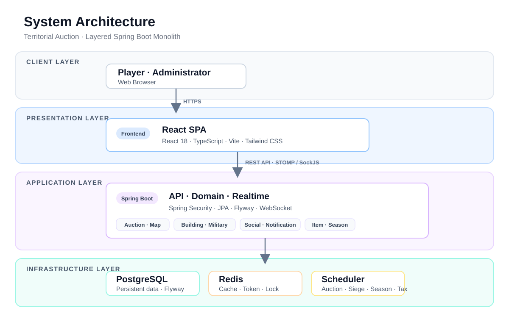

# 픽셀 경매 · 사이버 영토 전쟁

> **내 땅을 건설하고, 키우고, 지키거나 — 빼앗아라.**
> 50×50 월드맵에서 영토를 경매로 획득하고, 건설·자원 생산·공성전으로 성장하는 실시간 전략 웹 게임입니다.

<p align="center">
  <a href="https://claude.ai/code/artifact/366effa3-8970-4353-a97c-aa4a4fabe49f?via=auto_preview">인터랙티브 사용자 가이드 보기</a>
  ·
  <a href="docs/operations/local-production.md">로컬 Docker 실행하기</a>
  ·
  <a href="docs/README.md">전체 문서 보기</a>
</p>

## 목차

- [프로젝트 개요](#프로젝트-개요)
- [주요 화면과 플레이 흐름](#주요-화면과-플레이-흐름)
- [핵심 기능](#핵심-기능)
- [시스템 아키텍처](#시스템-아키텍처)
- [MSA 전환 현황](#msa-전환-현황)
- [기술 스택](#기술-스택)
- [빠른 시작](#빠른-시작)
- [테스트와 품질 검증](#테스트와-품질-검증)
- [가이드와 문서](#가이드와-문서)

## 프로젝트 개요

| 항목 | 내용 |
|---|---|
| 개발 형태 | 개인 프로젝트 |
| 개발 기간 | 2026.04 – 현재 (모놀리식 구현·검증 후 MSA 전환) |
| 핵심 경험 | 실시간 영토 경매, 그리드 건설, 자원 경제, 공성전, 길드·알림 |
| 현재 구조 | Spring Cloud Gateway + auction/user 서비스 + 잔여 Spring Boot 모놀리식 + React SPA |
| 실행 기준 | 로컬 MSA Docker Compose |

## 주요 화면과 플레이 흐름

실제 UI 화면과 클릭 흐름은 [인터랙티브 사용자 가이드](https://claude.ai/code/artifact/366effa3-8970-4353-a97c-aa4a4fabe49f?via=auto_preview)에 12개 화면으로 정리되어 있습니다.

| 화면 | 사용자 흐름 | 바로 보기 |
|---|---|---|
| 월드맵 | 8개 대륙을 탐색하고 원하는 대륙으로 진입 | [화면 보기](https://claude.ai/code/artifact/366effa3-8970-4353-a97c-aa4a4fabe49f?via=auto_preview) |
| 대륙·영토 | 격자에서 영토 상태를 확인하고 경매 상세를 열람 | [화면 보기](https://claude.ai/code/artifact/366effa3-8970-4353-a97c-aa4a4fabe49f?via=auto_preview) |
| 나의 섬·영토 | 건물 배치, 생산, 자원 관리를 수행 | [화면 보기](https://claude.ai/code/artifact/366effa3-8970-4353-a97c-aa4a4fabe49f?via=auto_preview) |
| 공성·길드 | 유닛을 편성해 공성하고, 길드와 실시간으로 협력 | [화면 보기](https://claude.ai/code/artifact/366effa3-8970-4353-a97c-aa4a4fabe49f?via=auto_preview) |
| 관리자 | 시즌·경매·사용자·공지·감사 로그를 운영 | [관리자 가이드](docs/guides/admin-guide.md) |

> README의 화면 썸네일은 저장소에 원본 캡처 파일을 추가하는 즉시 이 표에 고정합니다. 현재 가이드는 실제 프로젝트 화면을 포함한 공유 문서이며, 로컬 환경에서 동일한 화면을 확인할 수 있습니다.

## 핵심 기능

| 영역 | 기능 |
|---|---|
| 경매·영토 | 대륙별 영토 탐색, 실시간 입찰, Anti-Sniping, 낙찰·점유 처리 |
| 성장 | 개인 섬·영토 그리드 건설, GP·식량 생산, 금고, 아이템, 시즌 패스 |
| 전투 | Zone 기반 공성, 유닛 생산·주둔, 공격권, 전투 결과·보상 |
| 사회 | 길드, 대륙 채팅, 실시간 알림, 랭킹 |
| 운영 | 관리자 TOTP, 사용자·경매·밸런스 관리, 공지, 감사 로그 |

서비스 규칙과 경제 시스템의 상세는 [기획 개요](docs/planning/overview.md)와 [요구사항](docs/planning/requirements.md)을 참고하세요.

## 시스템 아키텍처

아래 그림은 MSA 전환의 기준점인 모놀리식 계층 구조이며, 현재 런타임 변화는 바로 다음 절과 [MSA 전환 현황](#msa-전환-현황)에 정리되어 있습니다.



- 프론트엔드는 REST와 STOMP/SockJS로 백엔드와 통신합니다.
- 공개 REST 요청은 Spring Cloud Gateway를 거칩니다.
- auction-service와 user-service는 각각 독립 PostgreSQL을 소유합니다. combat-service는 전용 DB·보안·Flyway와 building core 이관을 진행 중이며, 공개 요청은 계약 연결과 cutover 전까지 모놀리식이 처리합니다.
- 서비스 간 상태 변경은 내부 HTTP 계약과 비동기 이벤트로 전달하며 다른 서비스 DB를 직접 참조하지 않습니다.

자세한 구조와 도메인 간 의존 규칙은 [시스템 아키텍처](docs/design/architecture.md), [MSA 전환 허브](docs/design/msa/README.md), [내부 서비스 계약](docs/api/internal.md), [WebSocket 문서](docs/api/websocket/README.md)에 정리했습니다.

## MSA 전환 현황

도메인을 한 번에 모두 옮기지 않고, 서비스 하나가 완성될 때까지 모놀리식이 계속 요청을 처리하는 Strangler 방식으로 전환하고 있습니다.

| 단계 | 서비스 | 상태 | 상세 |
|---|---|---|---|
| 1 | auction-service | 완료 | [추출 설계](docs/design/msa/auction-extraction.md) · [이관 기록](docs/design/msa/auction-migration-tracking.md) |
| 2 | user-service | 완료 | [추출 설계](docs/design/msa/user-extraction.md) |
| 3 | combat-service | scaffold 완료·building core 구현 중 | [추출 설계](docs/design/msa/combat-extraction.md) · [이관 기록](docs/design/msa/combat-migration-tracking.md) |

전체 목표 토폴로지와 이후 economy, social, notification, map 분리 순서는 [MSA 전환 로드맵](docs/design/msa/README.md)을 참고하세요.

## 기술 스택

### 🎨 Frontend & ⚙️ Backend

| 구분 | 기술 스택 |
|---|---|
| Languages |   |
| Frameworks |    |
| UI & Build |    |
| Auth & Realtime |   |
| Data & Messaging |     |

### 🧪 Quality & 🛠️ Collaboration

| 구분 | 기술 스택 |
|---|---|
| Testing |     |
| Local Infra |   |
| Collaboration |   |
| AI Assistance |   |

## 빠른 시작

현재 Strangler 구조 전체를 확인할 때는 MSA Compose를 사용합니다.

```bash
cp backend/.env.example backend/.env
# backend/.env의 JWT_SECRET 등을 로컬 값으로 설정
INTERNAL_API_SECRET=local-internal-secret docker compose -f docker-compose.msa.yml up -d --build
```

- 사용자 화면: `http://localhost:3000`
- Gateway: `http://localhost:8090`
- Monolith health: `http://localhost:8080/actuator/health`

서비스별 선택 기동은 [로컬 MSA 실행 가이드](docs/design/msa/local-run.md), 모놀리식 운영·관리자 초기화·백업·복구는 [로컬 운영 실행 가이드](docs/operations/local-production.md)를 따르세요.

## 테스트와 품질 검증

### 부하 테스트

| 시나리오 | 부하 | 핵심 결과 | 결과 |
|---|---|---|---|
| 우선순위 혼합 Soak | 맵 30 + 경매 20 VU, 1시간 | 71,665 요청, 실패 0, p95 21ms / p99 247ms | [상세](docs/testing/README.md#부하-테스트-요약) |
| STOMP fan-out | 구독자 100명, 메시지 1건 | 100/100 수신, p95 70ms, 실패 0 | [상세](docs/testing/README.md#부하-테스트-요약) |
| 단일 경매 집중 Stress | 50→400 VU | 438.09 RPS, 지속 경합 p95 1,582ms | [한계 분석](report/perf/2026-08-20-all-priority1-3-comparison.md) |

ETag 조건부 조회로 전체 맵 재전송 병목을 해소했다. 단일 인기 경매의 지속 경합 한계는 Auction을 첫 MSA 분리 대상으로 선택한 근거가 됐다.

### API와 단위 테스트

| 범위 | 검증 구성 | 문서 |
|---|---|---|
| API 계약 | REST 공통 규칙·도메인별 엔드포인트·STOMP 채널 | [API 명세](docs/api/README.md) · [WebSocket 문서](docs/api/websocket/README.md) |
| Backend | JUnit 5·Mockito, Service 성공·실패·경계값, 테스트 클래스 48개 | [테스트 전략](docs/design/testing.md) |
| Frontend | Vitest·React Testing Library, 훅 상태 전이·컴포넌트 상호작용, 테스트 파일 3개 | [테스트 전략](docs/design/testing.md) |

- Backend: `./gradlew spotlessCheck test gatlingClasses`
- Frontend: `npm run test:run`, `npm run build`
- 로컬 Docker 사용자·관리자 수동 흐름과 Render·Supabase·Upstash 외부 호환성 스모크를 완료했다.

전체 기준과 알려진 제한은 [v1.0.0 모놀리식 릴리스 기준점](docs/releases/v1.0.0-monolith.md), 현재 구현 현황은 [체크리스트](docs/checklist.md)에서 확인할 수 있습니다.

> Render Free는 512MB 메모리 한도로 현재 모놀리식의 지속 실행 환경에 적합하지 않습니다. 외부 설정은 호환성 재현용으로만 보관하며, 상시 실행은 로컬 Docker Compose를 사용합니다. 자세한 내용은 [외부 호환성 검증 가이드](docs/operations/external-render-supabase.md)를 참고하세요.

## 가이드와 문서

| 대상 | 문서 |
|---|---|
| 플레이어 | [인터랙티브 사용자 가이드](https://claude.ai/code/artifact/366effa3-8970-4353-a97c-aa4a4fabe49f?via=auto_preview) · [텍스트 사용자 가이드](docs/guides/user-guide.md) |
| 관리자 | [관리자 운영 가이드](docs/guides/admin-guide.md) · [관리자 API](docs/api/admin.md) |
| 개발자 | [문서 인덱스](docs/README.md) · [MSA 전환](docs/design/msa/README.md) · [API 공통 규칙](docs/api/README.md) · [코드 컨벤션](docs/design/code-conventions.md) |
| 검증 | [테스트·검증 인덱스](docs/testing/README.md) · [성능 테스트 가이드](docs/design/performance-testing.md) |
| 운영 | [로컬 운영](docs/operations/local-production.md) · [외부 호환성 검증](docs/operations/external-render-supabase.md) · [v1.0.0 릴리스 기준](docs/releases/v1.0.0-monolith.md) |

## 개발 흐름

서비스 추출은 `feature/* → msa/{service} → dev → main` 흐름을 사용합니다.

- `feature/*`: 서비스 추출의 작은 단계 작업 브랜치
- `msa/{service}`: 단계 작업을 누적 검토하는 서비스 통합 브랜치
- `dev`: 로컬 개발 통합 브랜치
- `main`: 릴리스·외부 호환성 설정 기준 브랜치
- `main`의 배포 설정은 자동 실행하지 않습니다.

세부 브랜치·검증·PR 흐름은 [개발 워크플로](docs/guides/development-workflow.md)를 참고하세요.

## License

This project is licensed under the [MIT License](LICENSE).
